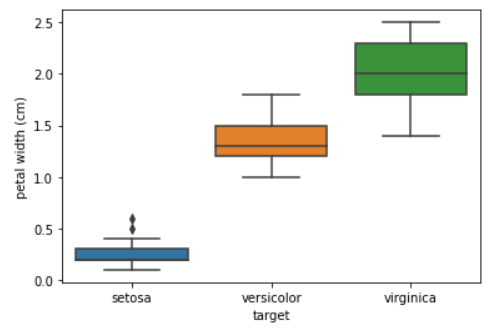

# 활용과제 발굴 방법

## Data Driven 방식의 과제 도출

* 데이터 현황과 수요조사 통한 빅데이터 과제 도출접근 방법
* 1단계
  * 데이터베이스, File, 엑셀자료 등을 통해 보유하고 있는 데이터 확인
  * 데이터의 성격을 분석하여 과제로 추진할 수 있는 주제 기술
  * 정형/비정형 데이터의 구분
  * 데이터 흐름도를 통해 분석
* 2단계
  * 내외부(민원, 업무담당자)의 직접적 수요과제 도출(과제수요서)
  * 실무 담당자의 업무 애로사항, 문제점, 민원 수집/분석 => 해결방안 도출
* 3단계
  * 수요과제 주제로부터 설계적 방향을 기술
  * 데이터를 활용한 상위 수준의 개념을 설계함

* 실시간 반영되는 데이터 => 오퍼레이셔널, 트랜잭셔널


# 빅데이터 분석 Tool을 이용한 분석

## 아이리스(iris) 데이터 시각화

```python
from sklearn.datasets import load_iris # scikit-learn의 샘플 데이터 로드를 위한 import
import pandas as pd # 데이터 프레임으로 변환을 위해 임포트

iris = load_iris()

# featured_names와 target을 레코드로 갖는 데이터프레임 생성
df = pd.DataFrame(data=iris.data, columns=iris.feature_names)
df['target'] = iris.target

# 0.0, 1.0, 2.0으로 표현된 label을 문자열로 매핑
df['target'] = df['target'].map({0:'setosa', 1:'versicolor', 2:'virginica'})

# 시각화를 위한 패키지 임포트
import matplotlib.pyplot as plt
import seaborn as sns

# 슬라이싱을 통해 feature와 label 분리
x_data = df.iloc[:,:-1]
y_data = df.iloc[:, [-1]]

# 시각화 - 박스플롯
sns.boxplot(x="target", y="petal width (cm)", data=df)
plt.show()
```




## BigZAMi(빅재미)를 활용한 데이터 시각화

