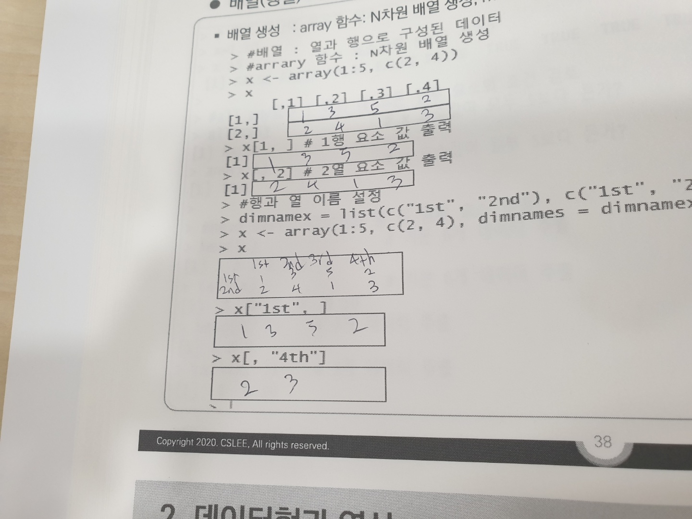
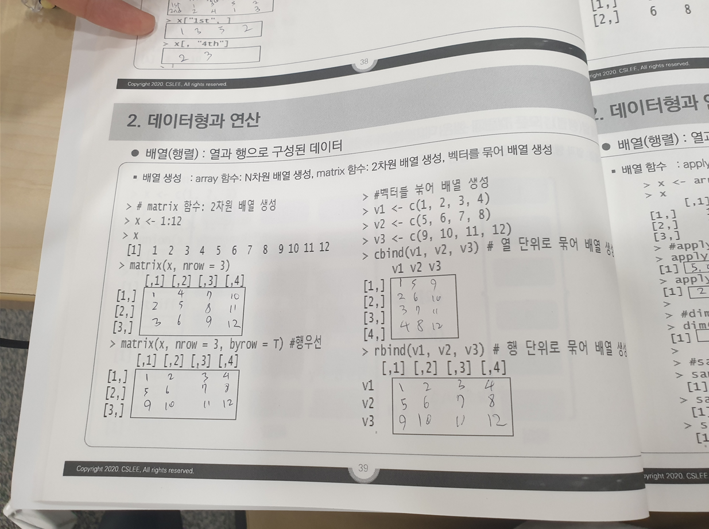

# 200825_데이터 이해 및 정형 데이터 다루기

## 1. 데이터와 데이터 베이스의 이해

### 1. 데이터, 데이터베이스 이해

* 지식의 피라미드(DIKW 피라미드)

  * 데이터 -> 정보 -> 지식 -> 지혜
  * 데이터 : 강수량
  * 정보 : 지역별 연간 최대 강수량
  * 지식 : A마을의 수혜 대책
  * 지혜 : A 마을 주민 생활 노하우

* 존재적 특징

  * 정성적 데이터(Qualitativ Data) : 데이터 하나하나가 함축된 의미를 가지고 있음
  * eg) 나는 오늘 기분이 좋다
  * 정량적 데이터(Qualitative Data) : 측정이나 설명이 가능하도록 구성됨
  * eg) 이름, 나이, 성별, 주소

* 형태적 특징

  * 정형데이터 : 고정된 필드에 저장된 데이터로 저장하는 데이터의 구조(스키마, 메타데이터)가 미리 정의된 데이터
  * 반정형데이터
  * 비정형데이터 : 데이터 세트가 아닌 하나의 데이터가 수집 데이터가 객체화되어있는 비구조적 데이터 eg) 동영상, 이미지, 소셜 데이터 텍스트

* 파일시스템

  * 파일 중심의 관리 형태로 데이터를 파일에 저장하거나 파일에서 정보를 읽어 데이터를 추가, 삭제, 수정, 검색 등의 기능을 통해 사용자가 원하는 정보를 손쉽게 이용하도록 해주는 프로그램

  * 서로 다른 시스템 간에 공유가 안됨 => 특정 응용 프로그램에서만 사용 가능
  * 중복이 가능해 무결성 문제 발생 가능성

* 데이터베이스

  * 통합, 저장, 운영, 공용 데이터의 집합

* 데이터베이스의 장점

  * 종이에 기록하는 전통적인 방법에 비한 장점: 압축성, 처리속도, 단조롭게 고된 일 감소, 현재성

  * 중앙집중 제어를 갖는 데이터베이스 장점: 중복성 감소, 불일치 피함, 데이터 공유, 표준화, 보안, 무결성


## 워크샵

### 회원등록 및 주문

* 도서 구입을 위해서는 회사에 회원으로 등록해야 가능

* 회원(회원번호, 주민등록번호, 주소, 전화번호, 전자메일ID, 휴대폰번호, 결재방법)
* 회원 - 정회원(취미명, 생일일자), 부회원(임시등록번호, 가입경로내용)
* 주문서양식(상세정보, 주문일자, 배송지주소, 배송지전화번호, 배송방법, 결재방법, 전해주는말)
* 주문목록(구매가격, 개수)
* 한번 등록된 회원에 대해서는 구매 포인트 부여
* 포인트 부여기준은 구매가의 1%
* 회원이 책을 구매하기 위해 체크하였다가 다른 시간에도 구매가 가능


# 200826_공공 빅데이터 청년 인턴십 확대 운영 데이터 전문교육과정

* `R Studio`는 관리자 권한으로 실행해야 패키지를 자유롭게 설치할 수 있다
* R에서 `alt + =` 누르면 자간 벌어짐
* `Control + -` 누르면 `<-` 생기는 단축키
* R은 인덱스가 1부터 시작하는 듯

## 데이터형과 연산

### 변수

* 대소문자 구별
* 특수문자 불가
* 밑줄이나 마침표 기호 가능
* 변수이름의 첫글자로 숫자나 밑줄 불가
* if, while, for 등의 예약어 X

### 데이터형

* 특수상수
* NULL : 정의되지 않은 값
* NA(Not Available): 결측값
* -Inf(음의 무한대), Inf(양의 무한대)
* NaN(Not a Number): 0/0, Inf/Inf 등과 같이 연산 불가능한 값 표시
* is.integer(x): x가 정수형이면 TRUE, 아니면 FALSE
* is.integer(1) 하면 FALSE 나옴 => 숫자는 기본적으로 실수로 들어가기 때문에

### 산술연산자

* x %/% y: x를 y로 나눈 몫(정수 나눗셈 몫)
* 5 %/% 2 : 2

### 벡터생성연산자

* c함수: 주어진 인수로 벡터 생성
* x <- c(1, 2, 3, 4)
* y <- c(x, c(1:3))
* seq 함수 이용: 순차적 벡터 생성
* seq(from=1, to=10, by=2)
* seq(1, 10, by=2)
* rep 함수 이용: 반복 벡터 생성
* rep(c(1:3), times=2)
* rep(c(1:3), each=2)


### 배열(행렬): 열과 행으로 구성된 데이터

* 배열 생성: array 함수- N차원 배열 생성, matrix 함수 - 2차원 배열 생성, 벡터를 묶어 배열 생성

* dimnamex = list(c("1st", "2nd"), c("1st", "2nd", "3rd", "4th"))

* x <- array(1:5, c(2, 4), dimnames=dimnamex)

  

* x <- 1:12

* matrix(x, nrow=3)

* matrix(x, nrow=3, byrow=T) # 행 우선

* v1 <- c(1, 2, 3, 4)

* v2 <- c(5, 6, 7, 8)

* v3 <- c(9, 10, 11, 12)

* cbind(v1, v2, v3)

* rbind(v1, v2, v3)

  

* 2*2 행렬 2개를 각각 x, y에 저장
* x <- array(1:4, dim=c(2, 2)) 
* y <- array(5:8, dim=c(2, 2))
* apply 함수: 행열로 함수적용
* apply(x, 1, mean)  # 함수를 행으로 적용
* apply(x, 2, mean)  # 함수를 열로 적용
* dim 함수: 배열 크기 dim(x)
* sample(x, 10) : 임의로 x에서 10개의 함수를 추출
* factor(c(...)) : c 안에 지정된 자료들만 쓸 수 있게 설정
* attach(데이터) : 데이터 부착하여 $ 없이 접근할 수 있게 설정
* detach : 데이터 탈착

### 리스트

* 서로 다른 기본 데이터형을 갖는 자료 구조를 포함할 수 있음
* 데이터 프레임보다 넓은 의미의 데이터 모임
* 데이터 프레임과 달리 모든 속성의 크기가 같을 필요가 없음


## 데이터 취득과 정제

### 파일 읽고 쓰기

* read.table: 일반 텍스트 파일을 읽을 때 사용
* students <- read.table("C:/r/students.txt", header=T)
* str(students): 파일의 구조 확인
* read.csv: csv 파일을 읽을 때 사용
* students$value <- as.character(students$name) : name 속성을 요인에서 문장으로 변경
* students <- read.csv("경로", stringsAsFactors=FALSE) : 파일을 읽을 때 문장을 요인으로 인식하지 않도록 설정함
* write.table(students, file="원하는 파일경로와 이름", [quote=F]): quote=F을 하면 문장에 큰 따옴표가 표시되지 않음

### 데이터 정제를 위한 조건문

* if문(if, else if, else), ifelse 문

### 데이터 정제를 위한 반복문

* ```R
  repeat{
      반복을 수행할 문장
  }
  ```

  ```R
  while(조건식){
      조건식이 참일 때 수행할 문장
  }
  ```

  ```R
  for(변수 in 데이터){
      반복 수행할 문장
  }
  ```

* paste: 나열된 원소 사이에 공백을 두고 결과값을 출력

* paste0: 나열된 원소 사이에 공백없이 출력

* cat: print와 유사하나 줄을 바꾸지 않고 그대로 출력


# 200827_R로 배우는 통계이해

## 통계기초

* t-test와 f-test 등 통계 검정을 하기에 앞서서 `정규성(normality)`과 `등분산성(homogeneity of varience)` 검사를 해야함

### 정규성 검정

* 표본이 2000개 이상이면 `Kolmogorov-Smirnov test`, 표본이 2000개 이하이면 `Shapiro-Wilk test`
* H0(귀무가설): 표본의 모집단이 정규분포를 따른다.
* H1(대립가설): 표본의 모집단이 정규분포를 따르지 않는다.
* shapiro.test(데이터)

## t표본 검정

* 두 집단 간의 차이가 있는지 확인
* 정규성 검정 필요
* t.test(데이터, [alternative=c("greater" or "less" or "two.sided")])


# 200827_R로 배우는 통계 이해

# 통계적 실험과 유의성 검정

# 가설 검정

* 가설 수립-> 실험을 설계-> 데이터를 수집 -> 추론 및 결론을 도출

* A/B 검정
  * 두 처리 방법/제품/절차 중 어느 쪽이 다른 쪽보다 우월하다는 것을 입증하기 위해 실험군을 두 그룹으로 나누어 진행하는 실험
  * 처리군(특정 처리에 노출된 대상들의 집단), 대조군(어떠한 처리도 하지 않은 대상들의 집단)
* p-value
  * 결과가 우연에서 비롯될 확률
* 유의수준
  * 우연히 발생한 것인지, 진짜 특별한 것인지를 결정하는 기준
  * 보통 0.05를 기준으로 하지만, 절대적인 것은 아님
  * 유의 수준이 0.05일 때, p value가 0.05 이하면, 즉 우연히 어떤 결과가 발생했을 확률이 0.05이하이면, 귀무가설을 기각되고, 대립가설이 채택

## 통계적 유의성과 p값

* 제1종오류(H0가  참인데 기각하는 경우): 죄 없는 피의자 -> 죄 있다
* 제2종오류(H0가 거짓인데 기각하지 않는 경우): 죄 있는 피의자-> 죄 없다

* t.test에서 데이터가 하나만 들어가면 mu=0이라 가정


## 자유도

* 표본을 통해 모집단의 분산 추정 시 분모에 n을 사용하면 살짝 아래쪽으로 편향발생
* 이때 분모에 n-1을 사용하면 추정 값에 편향이 발생하지 않음
* 회귀에서 (다중 공선성을 피하기 위해) 범주형 변수들을 n-1 지표 혹은 더미 변수로 요인(factor)화할 때 많이 사용

## 분산분석

* summary(aov(Time~Page, data=four_sessions))
* oneway.test(four_session$Time~four_sessions$Page,var=T)

* 둘다 같은 결과


## 카이제곱검정

* 일반적으로 변수 간 독립성에 대한 귀무가설이 타당한지를 평가

* 피어슨 잔차

  * R = (관측값-기댓값)/sqrt(기대값)

* 카이제곱통계량은 피어슨 잔차의 제곱합

  * (카이제곱통계랑)X^2 = (관측값-기댓값)^2의 합/기댓값
  * 이 때 기대값은 독립을 가정했을 때의 기대값

* matrix(click_rate$Rate, nrow=3, ncol=2, byrow=TRUE)

  * nrow: 행의 개수
  * ncol: 열의 개수
  * byrow: TRUE이면 행을 기준으로 숫자가 들어감(-> 방향)

* 종속변수가 범주형 자료인 경우에 사용하는 분석기법

* 크게 적합도 검정, 독립성 검정, 동질성 검정의 3가지로 분류

* 적합도 검정

  * 관측값들이 어떤 이론적 분포를 따르고 있는지를 검정
  * 한 개의 요인을 대상으로 함

* 독립성 검정

  * 서로 다른 요인들에 의해 분할되어 있는 경우 그 요인들이 관찰값에 영향을 주고 있는지 아닌지, 요인들이 서로 연관이 있는지 없는지를 검정
  * 두 개의 요인을 대상으로 함

* 동질성 검정

  * 관측값들이 정해진 범주 내에서 서로 비슷하게 나타나고 있는지를 검정
  * 속성 A, B를 가진 부모집단 각각으로부터 정해진 표본의 크기만큼 자료를 추출하는 경우에 분할표에서 부모집단의 비율이 동일한가를 검정

  * 두 개의 요인을 대상으로 함


# 회귀와 예측

## 단순선형회귀

