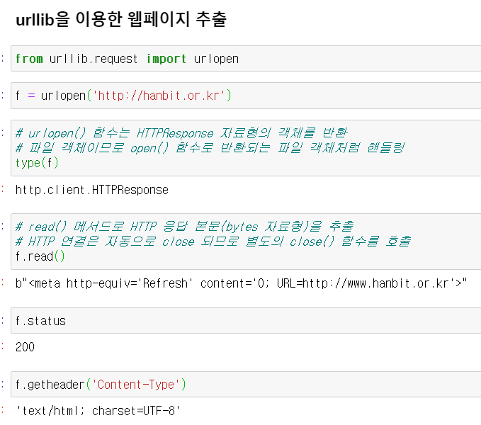
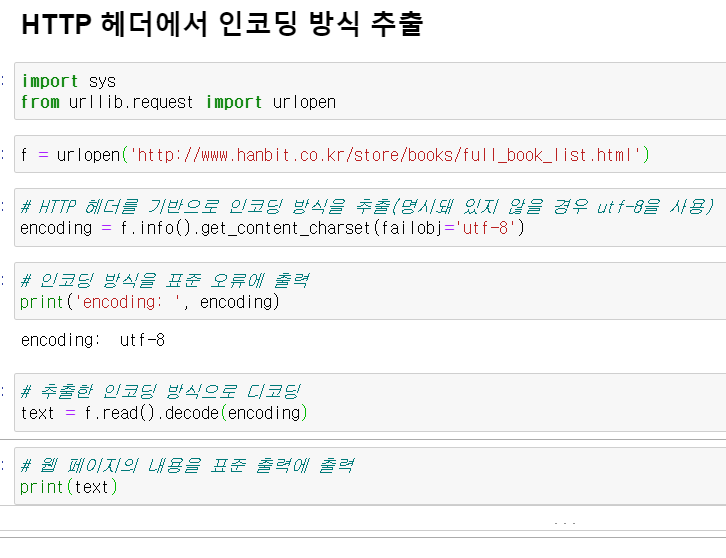
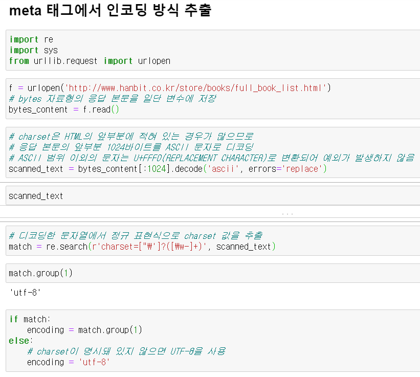

# 데이터 기반 행정 활성화에 관한 법률

## 추진배경

* 경험, 직관에 의존했던 기존의 의사결정

* 객관적 증거, 데이터에 기반한 과학적 행정체계 구축

## 법 주요내용

* 데이터기반행정 추진체계
* 데이터 등록 및 제공절차
* 데이터 관리 체계

# 웹 크롤링/스크래핑

## 웹 페이지 추출

* 웹 페이지를 추출 시 HTTP 헤더와 HTML의 meta 태그를 기반으로 인코딩 방식을 판별 필요

* 표준 라이브러리 urllib.request 모듈을 사용하여 웹페이지 추출

* urllib.request에 포함돼 있는 urlopen() 함수에 URL을 지정하면 웹 페이지 추출 가능

* HTTP 헤더를 변경 불가, Basic 인증을 사용을 위한 복잡한 처리 필요

* HTTP 헤더 변경 및 Basic 인증을 위해 urllib 대신 Requests 모듈 사용 필요

  

## 문자코드 다루기

* HTTPResponse.read() 메서드로 추출할 수 있는 HTTPResponse 본문은 bytes 자료형
* 문자열(str 자료형)로 다루려면 문자 코드를 지정해서 디코딩 필요
* 최근에는 HTML5의 기본 인코딩 방식인 UTF-8로 전제로 디코딩 가능
* 한국어 사이트를 크롤링 시 여러가지 인코딩이 혼합되어 있을 수 있으므로 HTTP 헤더를 참조해서 적절한 인코딩 방식으로 디코딩 필요

## HTTP 헤더에서 인코딩 방식 추출

* HTTP 응답의 Content-Type 헤더를 참조하면 해당 페이지의 인코딩 방식을 확인 가능

* 한국어가 포함된 페이지의 일반적인 Content-Type 헤더

  * text/html
  * text/html; charset=UTF-8
  * text/html; charset=EUC-KR

* UTF-8과 EUC-KR이 해당 페이지의 인코딩 방식

* 인코딩이 명시돼 있지 않은 경우 UTF-8 인코딩으로 간주

* HTTPMessage 객체의 get_content_charset() 메서드를 사용하여 인코딩 추출 가능

  

## meta 태그에서 인코딩 방식 추출

* 웹 서버 설정에 따라 HTTP 헤더의 Content-Type 인코딩과 실제 사용되고 있는 인코딩 형식 상이

* 브라우저는 HTML 내부의 meta 태그 또는 응답 본문의 바이트열 확인을 통해 최종 인코딩 방식 결정 및 화면 출력

* 디코딩 처리에서 UnicodeDecodeError 발생 시 이러한 방식으로 구현 가능

* HTML meta에 명시되는 인코딩 형식

  * \<meta charset="utf-8">
  * \<meat http-equiv="Content-Type" content="text/html; charset=EUC_KR">

* meta 태그에서 인코딩 방식 추출

  

## 웹 페이지에서 데이터 추출

* 정규 표현식을 이용한 스크래핑은 HTML을 단순한 문자열로 취급하여 필요한 정보 추출

  마크업 되지 않은 웹 페이지도 문자열의 특징을 파악하면 스크래핑 가능

* XML 파서를 이용한 스크래핑은 XML 태그를 분석(파싱)하여 필요한 정보 추출

  블로그 또는 뉴스사이트 정보를 전달하기 위한 RSS와 같이 많은 데이터가 XML형태로 제공

  XML 파서를 사용하면 정규 표현식보다 간단하고 효과적으로 필요한 정보 추출 가능

* HTML을 스크래핑할 때는 HTML 전용 파서가 필요

  파이썬의 표준 모듈인 html.parser 모듈을 사용하면 HTML 파싱 가능(복잡한 처리 필요)

  lxml 등과 같은 라이브러리를 사용하여 HTML 파싱 필요

## 졸리다..............

ㅁㄴㅇㄻㄴㅇㄻㄴㅇㄻㄴㅇㄹㅋㅌㅊㅍ